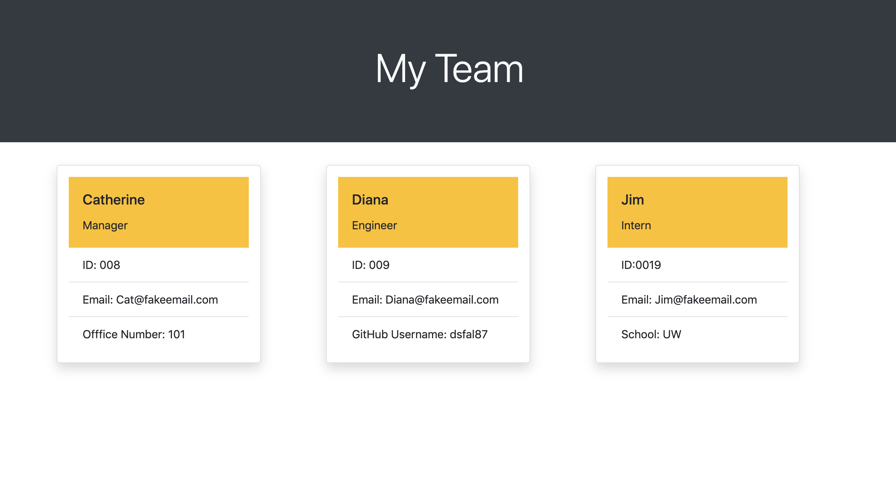

# team-profile-generator

# Table of Contents (Optional)
N/A

# Installation

View Github Repository. https://github.com/alexahanthony/team-profile-generator

# Usage

This commandline application allows you to build a team page. Employee types include, manager, engineer, and intern. The following content appears for each employee:

* Name
* Job Title
* ID
* Email
* Manager - Office Number
* Engineer - GitHub Username
* Intern - School

Using the command line, the user can create their team and a customized HTML file is generated.

# Credits
There were no collaborators, (other than classmates and teacher feedback).

# NPM Packages: 
*  "inquirer": "^7.0.1"
*  "jest": "^24.8.0"

# Third-party assets: 
https://getbootstrap.com/ for styling

https://stackoverflow.com/ for help with syntax

# License
N/A

# Badges
N/A

# Contributing
N/A

# Tests
N/A